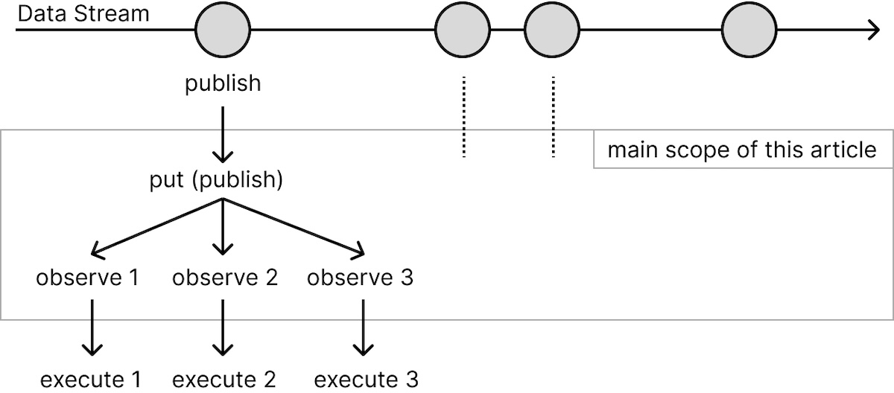

<div class="doc-header">
  <h1>iOSにおける非同期型イベント駆動</h1>
  <div class="doc-author">江本光晴</div>
</div>

iOSにおける非同期型イベント駆動
==

<!-- Qiita用 
:::note info
本記事は [技術書典16](https://techbookfest.org/event/tbf16) で無料配布する同人誌「ゆめみ大技林 '24」の寄稿です。加筆や修正などがある場合はこの記事で行います。
:::
-->

イベントに合わせて処理を実行したい、たとえばボタンタップのタイミングで処理を実行する場合は、次のようなコードを書けば実現できます（SwiftUI を使った例です）。

```swift
Button("Sign in") {
    signIn()
}

func signIn() {
    // ...
}
```

これは、イベント発生（ボタンタップ）と処理実行（関数実行）が同期されています。一方で、実装仕様や設計のため、イベント発生と処理実行を非同期（異なるタイミングや場所）で行いたいとき、どうすればいいでしょうか。

本記事はイベント発生と処理実行を非同期で実現するいくつかの方法をまとめました。なお、それらを解決する便利なサードライブラリもありますが、今回はアップルが提供するライブラリで実現できる方法を扱います。

<!-- Qiita用
### 免責事項

本書に記載された内容は、情報の提供のみを目的としています。これらの情報の運用は、ご自身の責任と判断によって行なってください。情報の運用の結果について、著者は責任を負わないものとします。

### 商標、登録商標について

本記事に記載される製品の名称は、各社の商標または登録商標です。本文中では、™、® などのマークは省略しています。
-->

## 非同期型イベント駆動

任意なタイミングや頻度で連続的に発生されるデータの流れをデータストリーム [^data-stream] と呼びます。そのストリームが発生させるデータは、発生頻度が任意で、突然増加するなど不規則です。ユーザーが任意なタイミングでアクションを実行する、Web サーバーから新しいデータが伝達されるなど、データストリームはいろいろあります。

データストリームはイベント発生のタイミングが不確定です。イベント発生が起こった時に、それに対応するプロセス（イベント監視と処理実行）を実行する画面やシーンがアクティブになっているとは限りません。また、イベントの監視をメインスレッドで行うと、画面応答やパフォーマンスは低下します。そのため、イベントの監視とイベントに対する処理実行を分離し、非同期処理を利用して異なるスレッドで監視します。これにより、アプリのパフォーマンスを維持しつつ、ストリームを効率的に管理します。

[^data-stream]: https://ibisforest.org/index.php?データストリーム

### 本記事が扱うスコープ

本記事は、データストリームが発生したデータに対して、発行と購読の方法を説明します。

- ストリームのデータを受け取り、いくつかの方法で発行する
- その発行を購読して、受け取ったデータを処理関数に渡す



次のようなプロトコルをもつ制御クラスを想定します。ここで observeHandler はストリームから受け取ったデータを実行するクロージャです。

```swift
protocol EventDrivenActionProtocol {
    // ストリームが発生するデータ型（今回は文字列を想定）
    typealias EventMessage = String

    // ストリームから発生されたデータを受け取る関数
    func put(message: EventMessage)

    // イベントに応じて実行するクロージャ
    var observeHandler: ((EventMessage) -> Void)? { get set }
}
```

この制御クラスをデータストリームに組み込み、ストリームから発生したデータを発行します。たとえばデータ発生をクロージャで実現するストリームであれば、次のような形を想定します。

```swift
// イベント制御
let eventAction = EventDrivenActionProtocol()

// 開発者自身またはサードライブラリなどで定義されるデータストリーム
let dataStream = DataStream()

// ストリームのデータ発生はクロージャで実装されると仮定する
dataStream.publishHandler = { eventMessage in
    // イベント制御クラスにデータを渡して、データ発行を委託する
    eventAction.put(message: eventMessage)
}

//　イベント制御クラスから発行されたデータを受け取ったときの処理
eventAction.observeHandler = { eventMessage in
    // 受け取った eventMessage を使って、任意な処理を実行する
    // put からこのクロージャが実行されるまでの過程を取り扱います
}
```

本記事のスコープは、データストリームから発生したデータを制御クラスが発行し、そのデータを受け取って処理を実行させるまでの過程です。データストリームの責務は発行のみとして、スコープ外のデータストリームの実装や特性、購読後の処理実行は取り扱いしません。

なお、これから紹介するコード例は簡易的に示します。実際に利用する場合は、クラス内で適切に定義する、非同期関数を適切に実行させる必要があります。また、異なる関数や方法で実現できる場合もありますが、その他の実装例は省略します。ご了承ください。

## NotificationCenter

おそらく非同期の発行と購読でもっとも簡単なのは NotificationCenter の利用です。このイベント用の Notification.Name を作成して、それを利用してイベントを発行します。

```swift
extension Notification.Name {
    static let eventAction = Notification.Name("eventAction")
}

func put(message: EventMessage) {
    NotificationCenter.default.post(
        name: .eventAction,
        object: message
    )
}
```

発行されたイベントは addObserver で購読でき、イベントを受け取った時に実行する関数を指定します。この購読は同じ Notification.Name を指定すれば、他のクラスでも利用できます。ただし、その自由度の高さから、さまざまな場所で利用するとデバッグや検証が難しくなります。多用する場合は注意が必要です。

```swift
NotificationCenter.default.addObserver(
    self,
    selector: #selector(observe),
    name: .eventAction,
    object: nil
)

@objc func observe(notification: Notification) {
    guard let message = notification.object as? EventMessage else {
        return
    }
    self.observeHandler?(message)
}
```

設定した購読は、監視が不要になったとき、インスタンスを解放するときなどに、忘れずに解除します。購読解除を忘れると、メモリリークや予期しない動作など、さまざまな不具合を引き起こします。

```swift
NotificationCenter.default.removeObserver(
    self,
    name:.eventAction,
    object: nil
)
```

NotificationCenter はとても簡単に非同期なイベント処理を実装できます。その反面、過度に利用すると、パフォーマンスへの影響や、アーキテクチャを乱す可能性があります。適切な場面で利用して、オブジェクトの明確な設計を維持することが大切です。

## Combine

Combine は iOS 13 から追加された非同期処理などの多機能なリアクティブプログラミングのためのフレームワークです。Combine には発行と購読にいくつかの方法がありますが、簡単な例を紹介します。

データの発行は次のように作成できます。

```swift
import Combine

let subject = PassthroughSubject<EventMessage, Error>()

func put(message: EventMessage) {
    subject.send(message)
}
```

購読は発行した subject に対して設定します。この subject を public などにすれば、他クラスでも購読を受け取ることもできます。１つの発行に対して、購読は複数設定できます。

```swift
// 購読を格納しておく配列
var subscriptions = [AnyCancellable]()

// subject　で発行された値を受ける購読処理
subject.sink { [weak self] in
    self?.observeHandler?($0)
}.store(in: &subscriptions)
```

先節と同様に Combine にも購読解除があります。忘れずに、解除します。

```swift
subscriptions.forEach { $0.cancel() }
subscriptions.removeAll()
```

## Combine + async/await

Swift 5.5 から新しい非同期フレームワーク Swift Concurrency が登場しました。非同期処理を async/await で書けるようになりました。iOS 15 からのサポートでしたが、バックデプロイされて iOS 13 以上から利用できます。モダンな開発において、非同期処理の標準といえるでしょう。

前節 Combine の処理を async/await で書きたいと考えることがあるでしょう。その場合は、クロージャを非同期関数に変換できる withCheckedContinuation を利用します。

```swift
// 完了処理をクロージャで実行する関数を用意する
func receive(callback: @escaping (_ message: EventMessage) -> Void ){
    // 監視は一度限りで行い、検出後は破棄する
    // 破棄しないと withCheckedContinuation で多重呼出の扱いになりクラッシュする
    var cancellable: AnyCancellable? = nil
    cancellable = subject.sink {
        callback($0)
        cancellable?.cancel()
    }
}

// 購読を監視する関数
func observe() async -> Void {
    let value = await withCheckedContinuation { continuation in
        receive { message in
            continuation.resume(returning: message)
        }
    }
    observeHandler?(value)
}
```

## Combine + async/await（iOS 15+）

withCheckedContinuation はクロージャを非同期関数に変換できる便利な関数です。しかしながら、手間もあります。

- クロージャで完了処理を行う関数を作る
- その関数を withCheckedContinuation でラッピングする

この Combine の非同期関数への変換は、iOS 15 から Combine に追加された Future クラスのプロパティ value を利用すると、より簡単に変換できます。

```swift
var subscriptions = [AnyCancellable]()

func receive() -> Future <EventMessage, Never> {
    return Future { [weak self] promise in
        guard let self else { return }
        self.subject.sink {
            promise(.success($0))
        }.store(in: &self.subscriptions)
    }
}

func observe() async -> Void {
    let value = await receive().value
    observeHandler?(value)
}
```

バックデプロイで Swift Concurrency は iOS 13 から利用できますが、この Future の value を利用するには iOS 15 以上にする必要があります。いま、iOS 13, 14 は古い方ですが、開発するアプリのサポート範囲が広い場合は利用に注意してください。

## Swift Concurrency

前節で Combine を非同期関数に置き換えました。簡単に置き換えられるとはいえ、置換なしで使いたいですよね。

Swift Concurrency と聞くと async/await を思い浮かべる方が多いでしょう。しかし、ストリームを扱うができる AsyncStream も提供されています。

```swift
// AsyncStream の内部で continuation を発火させるための関数
var handler: ((EventMessage) -> Void)?

// ストリーム
var stream: AsyncStream<EventMessage> {
    AsyncStream { [weak self] continuation in
        self?.handler = { value in
            continuation.yield(value)
        }
    }
}

// ストリームに対して、データを発行する
func put(message: EventMessage) {
    handler?(message)
}

// ストリームから発行されるデータを購読する
for await value in stream {
    observeHandler(value)
}
```

## Swift Concurrency（iOS 17+）

前節の AsyncStream は、その内部関数を発火させる関数（コード例の handler にあたる関数）を外部で定義したりと、正直なところカッコ悪いです。そのためなのか、iOS 17 からより簡単にストリームを定義できる AsyncStream.makeStream が追加されました。この関数は iOS 17 以上にすると、iOS 13 以上の環境にもバックデプロイされるので、幅広い環境で利用できます。次のように、コード量も少なくなり、とても簡単になりました。

```swift
// ストリームを作成する
let (stream, continuation) = AsyncStream.makeStream(of: EventMessage.self)

// ストリームに対して、データを発行する
func put(message: EventMessage) {
    continuation.yield(message)
}

// ストリームから発行されるデータを購読する
for await value in stream {
    observeHandler(value)
}
```

ソースコードを見てのとおり、Swift Concurrency の発行と購読は対になっています。これまで取り上げた NotificationCenter や Combine の発行と購読は１対多にできます。Swift Concurrency が作るストリームは、既存のストリームを置き換えるものではなく、別物として考えるのがよいです。

## まとめ

非同期型イベント駆動を、いつくかの手法で実装する方法を紹介しました。発行と購読の関係が実装方法により異なる場合が出てくるので、利用シーンを考えて適切に選択する必要があります。個人的には `Combine + async/await（iOS 15+）` を気に入っていて、拙作のライブラリにも利用しています。

```url
https://github.com/mitsuharu/ReSwift-Saga
```

非同期型イベント駆動は監視と処理のロジックを明確に分離するので、コードの可読性や保守性の向上、アプリ全体のパフォーマンスを保全できます。しかしながら、過剰に利用すると、可読性が低下するので、適量を守るのが大切です。

さいごに、本記事が読者の非同期型イベント駆動の開発に少しでも貢献できれば幸いです。本記事で紹介したコード例は GitHub で公開しています。

```url
https://github.com/mitsuharu/EventDrivenSample
```

<!--
<hr class="page-break" />
-->

## Qiita 記事の案内

本記事は Qiita でも読むことができます。後述の URL または QR コードからアクセスしてください。加筆や修正などがある場合は Qiita 記事で対応しますのでご確認ください。また、ご質問等があれば、お気軽にコメントしてください。

```url
https://qiita.com/mitsuharu_e/items/xxx
```


