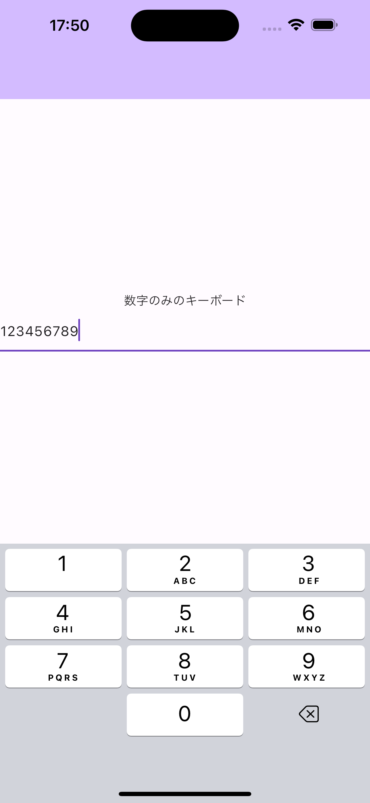
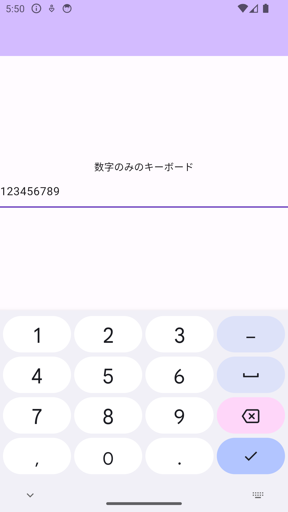
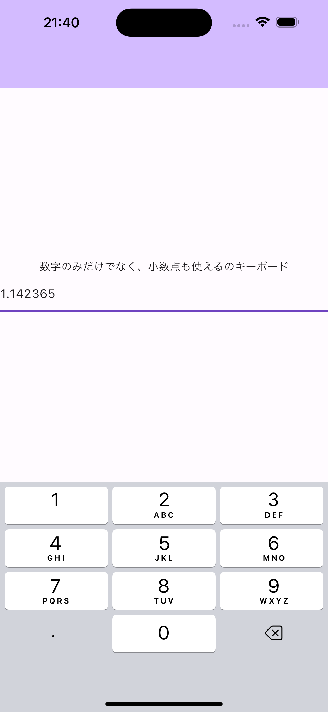
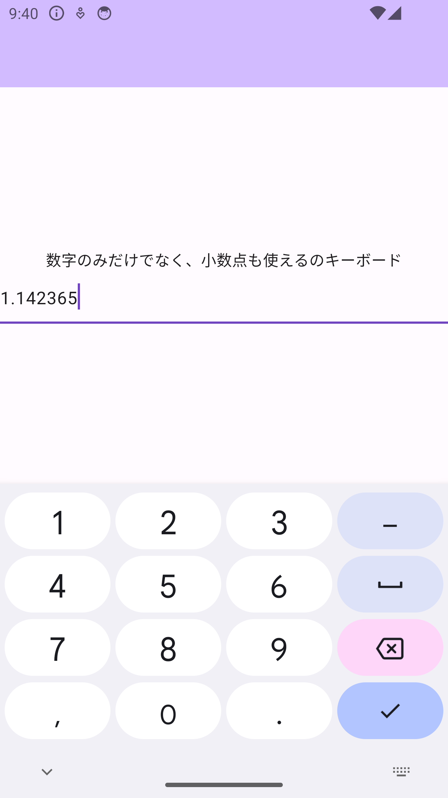

<div class="doc-header">
  <h1>【Flutter】TextFieldを数字のみだけでなく、小数点も使えるようにする方法</h1>
  <div class="doc-author">いせりゅー</div>
</div>

# 【Flutter】TextField を数字のみだけでなく、小数点も使えるようにする方法

## 本題

こんにちは。いせりゅーです。
Flutterにおいて、誰でも１度は見たある TextField に関する内容となっております。TextFieldのUI関連などについての記事はいくつかありましたが、「数字のみ」かつ「小数点は 2 文字目以降の入力ができる」という実装の記事が見つからなかったので、実装してみました。

## 数字のみの制限にする

数字のみの制限をするのはとても簡単に作ることができます。たった 2 行で実装することができます。

```dart
TextField(
  // 数値のキーボードが表示される
  keyboardType: TextInputType.number,
  // コピペなどで数字以外の入力を防ぐ
  inputFormatters: [FilteringTextInputFormatter.digitsOnly]
),
```

|                       iOS                        |                       Android                        |
| :----------------------------------------------: | :--------------------------------------------------: |
|  |  |

上のコードで実装自体は、70％ぐらいできましたが、「小数点は 2 文字目以降の入力ができる」という実装はまだできていません。
現状だと、数字のみの入力になるため、小数点は入力できません。Android だと小数点はキーボードにありますが、入力しても入力されません。

<hr class="page-break"/>

## 小数点の入力の制限をする

小数点を入力できるようにするには以下の考え方が必要になります。

- 最初の 1 行目は小数点を入力できないようにする。
  - 例）.01 や.10 は 今回の実装としては、入力できないようにしたい。
- 2 文字以降は自由に使えるようにしたい。
- 小数点は、1 回までの入力にしたい。
  - 例）1.01.0 や 1.0.0.1.3...4 などは変換するうえで不正な値になるから避けたい。

### 実装の道のり

```dart
TextInputType.numberWithOptions(decimal: true),
```
- `TextInputType.numberWithOptions`の`decimal`を true にすることで、小数点も使用することができるようにします。

```dart
  inputFormatters: <TextInputFormatter>[
    FilteringTextInputFormatter.allow(RegExp(r'^\d+(\.\d*)?')),
  ],
```

- 小数点の入力の制限をするには、先頭が数字であり、その後には小数点とそれに続く数字が続く形式の入力が許可すればうまくいきます。それを実現するためには正規表現を活用することだと考えています。正規表現は、特定のパターンに一致するテキストを検索したり、変更したりするための強力なツールです。
  - `^`・・・文字列の先頭からマッチすることを指定します。
  - `\d+`・・・1つ以上の数字にマッチします。
  - `(\.\d*)?`・・・小数点とそれに続く0個以上の数字の組み合わせにマッチします。


|                       iOS                        |                       Android                        |
| :----------------------------------------------: | :--------------------------------------------------: |
|  |  |


### ソースコード

```dart
TextField(
  keyboardType: const TextInputType.numberWithOptions(decimal: true),
  inputFormatters: <TextInputFormatter>[
    FilteringTextInputFormatter.allow(RegExp(r'^\d+(\.\d*)?')),
  ],
)
```

## 最後に

今回、参考になる記事が見つからなかったため、試行錯誤することがとても役立つことを感じました。考え方さえ理解してしまえば、ChatGPTと協力すれば、実装できる気がしています。今回の一番の収穫は、自分なりに考え方をまとめられたことだと思います。この良い発見が今後も続くといいなと思います。
