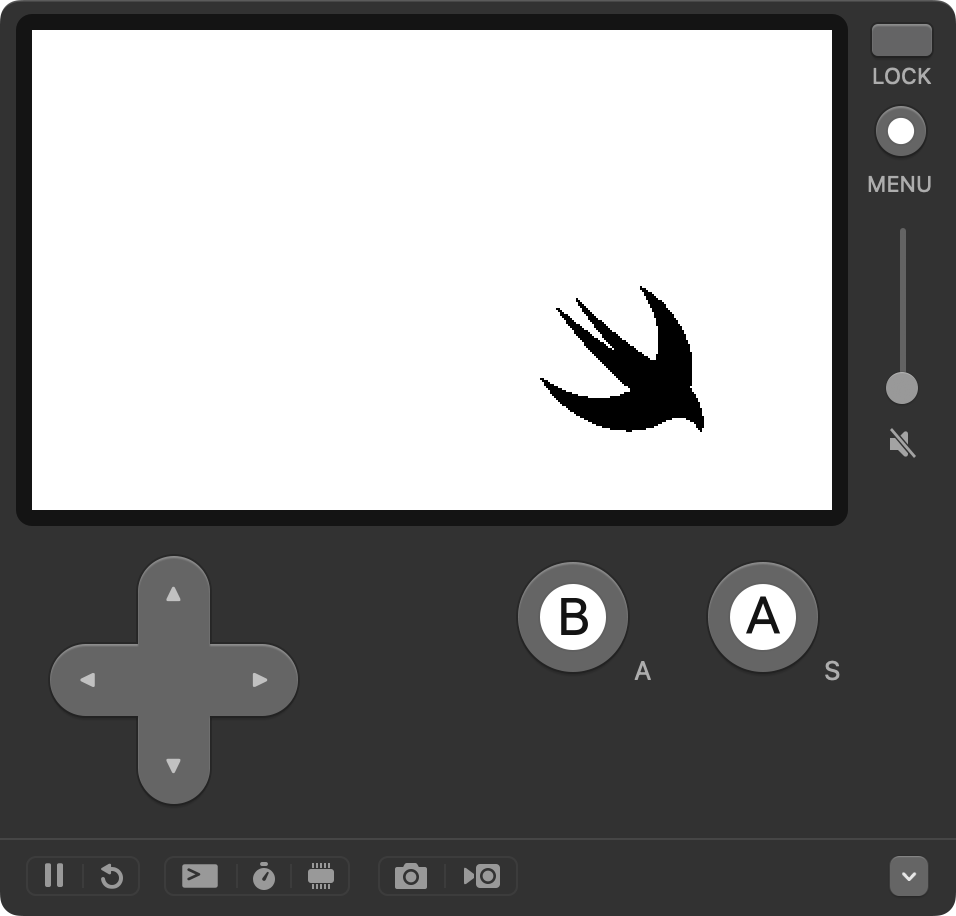

<div class="doc-header">
  <h1>「小さなアプリバイナリを構築する」で使用したサンプルコードをビルドする</h1>
  <div class="doc-author">栗山徹(kotetu/kotetuco)</div>
</div>

「小さなアプリバイナリを構築する」で使用したサンプルコードをビルドする
==

## はじめに

### Playdate で動作するアプリを Swift で実装することの衝撃

「try! Swift Tokyo 2024」[^1]で発表された「小さなアプリバイナリを構築する」[^2]は、筆者にとって興味深い内容でした。

まずはバイナリサイズを削減する目的を明示し、 Swift 言語のコンパイルプロセスを解説しながら、コンパイルプロセス中に行われる 3 種類の最適化フェーズが紹介されました。後半では、普段のアプリ開発でサイズに配慮したコードを書く方法が解説され、バイナリサイズのボトルネックを測定する方法や未使用コードの削減の重要性について紹介されました。発表は、実用的なノウハウだけでなく、 Swift のコンパイルプロセスといったディープな内容も含んだ興味深い内容でした。

ただ、筆者に大きな衝撃を与えたのは、発表の終盤で取り上げられた内容でした。その内容とは、「Playdate」[^3]という、 Panic 社が販売している携帯ゲーム機上で動作するアプリを Swift を使って実装する、というものでした。

筆者はこれまで、組み込みデバイスや携帯ゲーム機向けのアプリケーション開発において、 Swift が使われることはまずないだろうとずっと考えてきました。組み込み向けに使われるのは今でも C/C++ が多く [^4]、組み込み機器向けの開発については、 Swift のコミュニティではあまり議論されていないものと思い込んでいました。

それが、現在では Embedded Swift [^5]といった、組み込み機器向けに Swift 言語を使用するためのプロジェクトなどが発足したりと、組み込み分野における Swift の可能性を模索する動きが活発になっていました。

筆者はこれまで、 C 言語や Rust を使って OS 無しで動作するコードを書いたりしたことはありました。ただ、普段仕事で Swift を書いている身としては、 Swift の言語機能を使って組み込み機器向けのソフトウェアを開発できる可能性があることに、大きな期待感を抱きました。

[^1]: https://tryswift.jp/

[^2]: https://speakerdeck.com/kateinoigakukun/building-a-smaller-app-binary

[^3]: https://play.date/

[^4]: 最近では、 Rust などが使われるケースも出てきました。

[^5]: https://www.swift.org/blog/embedded-swift-examples/

### サンプルコードが動くようになるまでに一苦労

筆者も手元で動かしてみたいと思い、発表で紹介されていたサンプルコード[^6]を Clone してビルドしようとしましたが、これが一筋縄ではいきませんでした。

もっとも難しかったのは Swift Package Manager (以後、**SwiftPM**) [^7]を修正してビルドするところでしたが、それ以外にもいくつかハマりどころがありました。 Swift コンパイラへ普段から Contribute している方であればそこまでハマらないだろう箇所に初心者である筆者はさまざまな箇所でハマり込んでしまいました。

そんな悪戦苦闘を記録に残すことで、これから筆者と同様に Playdate や Embedded Swift に興味を持った方が少しでもスタートラインに立つことができるようなるかもしれない、と思い立ったことが本稿を執筆しようと思ったきっかけです。

[^6]: https://github.com/kateinoigakukun/swift-playdate
[^7]: https://github.com/apple/swift-package-manager

### 本稿の目的と対象読者

本稿では、「小さなアプリバイナリを構築する」で紹介されたサンプルコードである kateinoigakukun/swift-playdate リポジトリ(以後、 **swift-playdate リポジトリ** と記載)を題材にしています。 swift-playdate リポジトリのコードをビルドし、 Playdate のエミュレータでビルドしたプログラムが動作するまでの手順を解説します。

Swift の処理系や Embedded Swift について詳しくない方でも、ビルドしてエミュレータ上でサンプルアプリを動作できる(**図1**)ような構成になっています。また、ビルドできるように修正していく過程の中で、 Swift の処理系の構成についても一部解説しています。



なお、本稿では macOS Sonoma 14.4.1 がインストールされた Apple シリコン搭載機種を用いてビルドを行っています。 Linux や Windows 環境でビルドを行う場合は、ダウンロードする Snapshot や手順が異なります。

## サンプルコードをビルドできるまでの全記録

### 概要 〜 まずは全容を把握する

swift-playdate リポジトリをビルドするためには、 README.md に記載されている手順を実行するための下準備が必要です。下準備も含めて、実施しないといけない手順は次のとおりです。

1. ビルドに使用する Swift のツール一式をインストールする
2. Playdate SDK をインストールする
3. swift-playdate リポジトリを Clone する
4. build.sh を編集する
5. SwiftPM を修正してビルドする
6. playdate-ld を編集する

「1. ビルドに使用する Swift のツール一式をインストールする」と「2. Playdate SDK をインストールする」については、「Swift Playdate Examples」というドキュメントのチュートリアル[^8]の中に同様の解説があります。スクリーンショット付きで詳しく解説されているため、本稿の該当する箇所の解説を読み飛ばすことも可能です。

[^8]: https://apple.github.io/swift-playdate-examples/documentation/playdate/downloadingthetools/

### 1. ビルドに使用する Swift のツール一式をインストールする

iOS アプリや macOS 向けのアプリをビルドする場合は、 Xcode のインストール時に含まれる Swift のコマンドラインツール一式（Swift のコンパイラや SwiftPM など）を使用します。この Swift のツール一式のことを **Toolchain** と呼びます。

Playdate 用のアプリをはじめとする組み込み機器向けの機能は Experimental（実験的）な機能となるため、 Xcode のインストール時に含まれる Swift の Toolchain ではビルドできません。Experimental な機能が使用可能な Swift の Toolchain は **https://www.swift.org/download/#snapshots** からダウンロード可能です。今回は **Trunk Development (main)** と記載された開発中の Toolchain の Snapshot を使用します。

macOS でビルドを行う場合は Xcode と記載された行のリンク先から .pkg ファイルをダウンロードします。ダウンロードが完了したら、 .pkg ファイルを開きインストールを行ないます。基本的には画面の指示にしたがってインストールを進めれば問題ないはずですが、「インストール先の選択」において「このコンピュータのすべてのユーザ用にインストール」を選ぶか「自分専用にインストール」を選ぶかでインストール先が異なる点に注意が必要です。「このコンピュータのすべてのユーザ用にインストール」を選んだ場合は `/Library/Developer/Toolchains` にインストールされ、「自分専用にインストール」を選んだ場合は `$HOME/Library/Developer/Toolchains` にインストールされます。

筆者の場合インストールしたのは `swift-DEVELOPMENT-SNAPSHOT-2024-04-04-a` というバージョンでした。また、インストール時は「このコンピュータのすべてのユーザ用にインストール」を選択してインストールしました。したがって、インストール先は `/Library/Developer/Toolchains/swift-DEVELOPMENT-SNAPSHOT-2024-04-04-a.xctoolchain` となります。

### 2. Playdate SDK をインストールする

次に、Playdate のサイトから SDK をダウンロードし、ローカルへインストールします。 https://play.date/dev/ から macOS の場合は .pkg ファイルをダウンロードし、インストールします。

インストールが成功すると、 `$HOME/Developer/PlaydateSDK` に必要なファイル一式が生成されていることがわかります。

### 3. swift-playdate リポジトリを Clone する

次のコマンドで swift-playdate リポジトリを Clone します。

```shell
git clone https://github.com/kateinoigakukun/swift-playdate.git
```

Clone したら、 `swift-playdate` という名称のディレクトリができているはずです。

#### ディレクトリ内のファイル構成について

ディレクトリ内のファイルは、大きく分けて次のような構成になっています。

- Examples
  - サンプルアプリ本体。 Swift ロゴの描画や移動のロジック、画像リソース、ビルドスクリプトである build.sh もこちらのディレクトリに含まれる。
- Sources
  - アプリの共通処理が含まれる。
- SwiftSDKs/Playdate.artifactbundle
  - 「Artifact bundle」と呼ばれる、ビルド時に利用するモジュールが含まれる。Playdate.artifactbundle は、Playdate 用 SDK 周りのコンパイルと Swift コードとのリンクを行う。
- Package.swift
  - サンプルアプリのビルドで使用する、 Experimental 機能を有効にするための設定が含まれる。

#### Examples/build.sh を実行してみる

さて、ここまでの手順が終わった段階で、一度 build.sh を実行してみましょう。swift-playdate リポジトリの README.md に記載されている説明に従い、ターミナルで次のコマンドを実行します。

```shell
swift experimental-sdk install ./SwiftSDKs/Playdate.artifactbundle
cd swift-playdate/Examles
./build.sh
```

実行すると、早々に次のようなエラーが出力されるはずです。

```shell
$ ./build.sh
+ export TOOLCHAINS=org.swift.59202403011a
+ TOOLCHAINS=org.swift.59202403011a
+ swift-build --product Example --experimental-swift-sdk playdate -c release
./build.sh: line 7: swift-build: command not found
```

「swift-build: command not found」と出力されていることが分かるはずです。 **1.** で Toolchain をインストールしたはずなのに、 swift-build コマンドが見つからないのはなぜでしょう。

#### swift-build コマンドと swift コマンド

`swift-build` コマンドは、package.swift に記載されている内容にしたがって依存関係を解決しながらビルドを行うコマンドです。 実は、macOS 上の Swift Toolchain においては、 `swift-build` コマンドは `swift-package` のエイリアス（Windows でいうショートカットのようなもの）となっており、名前のとおり SwiftPM のモジュールのひとつです。 `swift-build` は、 **1.** でインストールした `.xctoolchain` 内の `/usr/bin` ディレクトリに存在します。したがって、環境変数 PATH に `swift-build` コマンドへの Path を追加することで、コマンドが見つからない問題は解決できそうです。

#### swift build コマンド と swift-build の関係性

`swift-build` コマンドを直接呼び出すことはほとんどなく、大抵は `swift build` コマンドとして間接的に呼び出されることが多いのではないでしょうか。実は、`swift-build` コマンドと同じように、`swift` コマンドも `swift-driver` コマンドのエイリアスとなっています[^9]。

`swift-driver` コマンドは、ユーザーからの入力を受け取って適切なコマンドを呼び出すためのプログラムです。

Swift に限らず、言語処理系はソースコードをビルドして実行可能バイナリを生成するまでの間に、複数のプログラムを呼び出して処理を行うことが多いです。 `swift-driver` コマンドは、一連のビルドプロセスの中で、ユーザーとのインタフェースやユーザーの入力に基づいてコンパイルプロセスを制御する役割を担っています[^10]。

ここまでの話をまとめると、 `swift build` コマンドを実行した場合、エイリアスによって `swift-driver` コマンドが実行され、さらに `swift-package` コマンドが呼ばれる仕組みとなっています。

[^9]: 同様に `swiftc` コマンドも `swift-driver` コマンドのエイリアスになっています。
[^10]: C 言語のコンパイラとして有名な gcc も、 gcc コマンド自体は実際にコンパイルを行う cc やリンクを行う ld を呼び出すためのドライバー的なコマンドになっています。

### 4. build.sh を編集する

`swift-build` コマンドと `swift` コマンドの関係性がわかったところで、さっそく build.sh を編集してビルドできるようにしましょう。

#### 「swift-build: command not found」を解決する

`swift-build` コマンドを使えるようにするための方法はふたつあります。ひとつは `swift-build` コマンドを `swift build` コマンドへ変更すること、もうひとつは、 `swift-build` コマンドへの Path を設定することです。 `swift build` コマンドへ変更する場合は build.sh を次のように修正します。

```shell
swift build --product Example --experimental-swift-sdk playdate -c release
```

Path を設定する場合は、`xcrun --find .` コマンドを使って `swift-build` が含まれるディレクトリの Path を取得し、環境変数 `PATH` へ設定します。

```shell
export PATH=${PATH}:`xcrun --find .`
```

#### TOOLCHAINS 環境変数の設定を変更する

build.sh には `export TOOLCHAINS=org.swift.59202403011a` という設定があります。これは **TOOLCHAINS** という環境変数の設定を行なっています。

TOOLCHAINS 環境変数は、利用する Toolchain を切り替えるために使用します。「org.swift.59202403011a」という文字列は、 **1.** でインストールした `.xctoolchain` の直下にある Info.plist 内の `CFBundleIdentifier` に記載されている ID のことです。つまり、TOOLCHAINS 環境変数には、この CFBundleIdentifier 値を設定する必要があります。

swift-playdate リポジトリの README.md には次のような記載があります。

```
1. Install swift-DEVELOPMENT-SNAPSHOT-2024-03-01-a toolchain from Swift.org
```

つまり、 build.sh の TOOLCHAINS で設定されている CFBundleIdentifier は、 2024-03-01 時点の Snapshot ということになります。したがって、現時点では使用したい Toolchain が指定されていないことになります。

CFBundleIdentifier 値は、テキストエディタで Info.plist を開き、次の箇所に記載されています（筆者がインストールした Toolchain の場合）。

```xml
<key>CFBundleIdentifier</key>
<string>org.swift.59202404041a</string>
```

CFBundleIdentifier がわかったところで、 build.sh を次のように修正しましょう。

```
export TOOLCHAINS=org.swift.59202404041a
```

#### 修正した build.sh を実行する

ここまで修正したところで、build.sh を再度実行してみましょう。

```shell
$ ./build.sh
+ export TOOLCHAINS=org.swift.59202404041a
+ TOOLCHAINS=org.swift.59202404041a
++ xcrun --find .
+ export PATH=/path/to
+ PATH=/path/to
+ swift-build --product Example --experimental-swift-sdk playdate -c release
warning: 'example': dependency 'swift-playdate' is not used by any target
Basics/Triple+Basics.swift:150: Fatal error: Cannot create dynamic libraries for os "noneOS".
./build.sh: line 8: 81204 Trace/BPT trap: 5       swift-build --product Example --experimental-swift-sdk playdate -c release
```

**Basics/Triple+Basics.swift** という箇所でエラーが発生しているようです。 `swift-build` コマンドは `swift-package` コマンドのエイリアスでした。よって、 `swift-package` コマンド内部でエラー終了したと考えて良さそうです。

### 5. SwiftPM を修正してビルドする

SwiftPM のコードを修正しなければならないということで、 Swift Package Manager リポジトリを Clone しましょう。

```shell
git clone https://github.com/apple/swift-package-manager.git
```

Clone したら、早速ビルドしましょう。今回は TOOLCHAINS 環境変数を指定して、**1.** でインストールした Toolchain を使用してビルドしてみましょう。

```shell
cd swift-package-manager
TOOLCHAINS=org.swift.59202404041a swift build
```

インストール済みの Toolchain を使用すれば、問題なくビルドできるはずです。

次に、ビルドした SwiftPM を優先して呼び出すために、PATH 環境変数にビルドした SwiftPM の Path を追加しましょう。

Swift Package Manager リポジトリの CONTRIBUTING.md [^11]によれば、生成されたバイナリは Apple Silicon 搭載 Mac の場合は `swift-package-manager/.build/arm64-apple-macosx/debug` に生成されます。したがって、PATH 環境変数は次のように変更します。なお、 `/path/to/` の部分については、ご自身の環境に合わせて変更してください。

```shell
export PATH=/path/to/swift-package-manager/.build/arm64-apple-macosx/debug:${PATH}:`xcrun --find .`
```

#### Basics/Triple+Basics.swift を修正する

改めてビルドエラーの内容を確認すると、 150 行目で `Cannot create dynamic libraries for os "noneOS"` という Fatal Error が発生したことがわかります。というわけで、 Basics/Triple+Basics.swift を確認してみたところ、次のような実装になっていました。

```swift
/// The file extension for dynamic libraries (eg. `.dll`, `.so`, or `.dylib`)
public var dynamicLibraryExtension: String {
    guard let os = self.os else {
        fatalError("Cannot create dynamic libraries unknown os.")
    }

    switch os {
    case _ where isDarwin():
        return ".dylib"
    case .linux, .openbsd:
        return ".so"
    case .win32:
        return ".dll"
    case .wasi:
        return ".wasm"
    default:
        fatalError("Cannot create dynamic libraries for os \"\(os)\".")
    }
}
```

dynamicLibraryExtension は、 os という Triple.OS 型の enum 定義の内容を元に適切な拡張子を返す computed property です。

Triple.OS は名前のとおり OS の種別を定義しており、 `.noneOS` は OS 無しで動作するアプリの場合に付与される種別です。 Playdate 内部には OS は搭載されていないことから、 Playdate 向けアプリは `.noneOS` が付与されることになります。

しかし、 dynamicLibraryExtension の実装では `.noneOS` だった場合は default に入ってしまい、fatalError が呼ばれてビルドが途中で止まってしまう状態となっています。よって、 `.noneOS` の場合に fatalError が呼ばれないよう修正すれば良さそうです。

swift-playdate リポジトリの README.md を見ると、 dynamicLibraryExtension でのエラーを回避するための修正に関する Pull Request が紹介されていました[^12]。

Pull Request の中で提案されている修正は、 default の場合は fatalError を呼ばずに一律 `".so"` を返すよう修正する内容でした。ただ、本稿では `.noneOS` の場合のみ動作すればよいので、影響を局所化するため、 `.noneOS` の場合は `".so"` を返すようにしました。

したがって、 dynamicLibraryExtension に対して次のような修正を入れました。

```swift
switch os {
case _ where isDarwin():
    return ".dylib"
case .linux, .openbsd, .noneOS: // 修正を入れた箇所
    return ".so"
case .win32:
    return ".dll"
case .wasi:
    return ".wasm"
default:
    fatalError("Cannot create dynamic libraries for os \"\(os)\".")
}
```

修正が完了したら、 SwiftPM を再度ビルドしましょう。ビルドが通ったら、 swift-playdate の Example に戻って、 build.sh を実行してみましょう。次のように結果が変わるはずです。

```shell
$ ./build.sh
...
+ swift-build --product Example --experimental-swift-sdk playdate -c release
Building for production...
warning: 'example': dependency 'swift-playdate' is not used by any target
warning: Could not read SDKSettings.json for SDK at: /usr/local/playdate/gcc-arm-none-eabi-9-2019-q4-major
error: link command failed with exit code 1 (use -v to see invocation)
...
/var/folders/4b/__gw6lmd2cd7q3rcjcgqw0fm0000gn/T//cchgn8hw.s: Assembler messages:
/var/folders/4b/__gw6lmd2cd7q3rcjcgqw0fm0000gn/T//cchgn8hw.s: Warning: can't open build/setup.lst: No such file or directory
/usr/local/playdate/gcc-arm-none-eabi-9-2019-q4-major/bin/../lib/gcc/arm-none-eabi/9.2.1/../../../../arm-none-eabi/bin/ld: cannot open linker script file /Users/katei/Developer/PlaydateSDK/C_API/buildsupport/link_map.ld: No such file or directory
collect2: error: ld returned 1 exit status
clang: error: ld.lld command failed with exit code 1 (use -v to see invocation)
[1/2] Linking Example
```

`collect2: error: ld returned 1 exit status` とあるとおり、今度は ld でエラー終了しています。よく見ると link_map.ld が見つからないようです。さらによく見ると link_map.ld の Path がローカルには存在しない Path となっています。この Path を使ってリポジトリ内を検索したところ、 `SwiftSDKs/Playdate.artifactbundle/generic/bin/playdate-ld` というシェルスクリプトファイルが見つかりました。 playdate-ld の Path を修正すれば、エラーも解消されそうです。

[^11]: https://github.com/apple/swift-package-manager/blob/main/CONTRIBUTING.md

[^12]: https://github.com/apple/swift-package-manager/pull/7417

### 6. playdate-ld を編集する

playdate-ld を修正すればよいことはわかりましたが、 playdate-ld とはそもそもどういったものなのでしょうか。

#### Artifact bundle について

**Artifact bundle** は、SE-0305 [^13]と呼ばれる Swift のプロポーザルに端を発した機能です。たとえば、 Mac 上で Linux 向けのクロスコンパイルを行いたい場合において、特定のビルドプロセスを標準の Toolchain とは別なツールを用いてビルドしたい場合に利用することを想定されています。

swift-playdate リポジトリを Clone した直後に `swift experimental-sdk install ./SwiftSDKs/Playdate.artifactbundle` を実行しました。これは、ビルドに利用する Artifact bundle を事前にインストールしておくためだったのです。

なお、インストール済みの Artifact bundle は、 `swift experimental-sdk list` で確認できます。

```shell
$ swift experimental-sdk list
playdate
```

#### playdate モジュールと playdate-ld

playdate モジュールは、Swift のコードをコンパイルした後に Playdate 用の実行可能バイナリを生成する処理が含まれています。ファイル一式は swift-playdate リポジトリの `SwiftSDKs/Playdate.artifactbundle/` にすべて含まれており、 playdate-ld というシェルスクリプトファイル以外は Artifact bundle 用の設定ファイルとなります。

playdate-ld では、 Playdate SDK の中で実行可能バイナリの生成に必要な C 言語ファイルのコンパイルと、 Swift コードとコンパイルされた Playdate SDK のオブジェクトとのリンクを行っています。

#### playdate モジュールを修正して再インストールする

Artifact bundle と playdate-ld のことがわかったところで、playdate-ld を修正しましょう。

playdate-ld を確認したところ、次のようなコマンドの記述が見つかりました。

```bash
exec /usr/local/bin/arm-none-eabi-gcc -g3 $tmpdir/setup.o $OBJS -nostartfiles -mthumb -mcpu=cortex-m7 -mfloat-abi=hard -mfpu=fpv5-sp-d16 -D__FPU_USED=1 -T/Users/katei/Developer/PlaydateSDK/C_API/buildsupport/link_map.ld -Wl,--gc-sections,--no-warn-mismatch,--emit-relocs    -o $OUTFILE
```

`-T/Users/katei/Developer/PlaydateSDK/C_API/buildsupport/link_map.ld` で指定している link_map.ld の Path が、 katei さんのローカル環境の絶対 Path になっているため、ユーザー名が異なる環境で link_map.ld が見つからない状態になっていたようです。というわけで、 link_map.ld の Path をインストール先の環境に合わせて修正しましょう。

link_map.ld は、 `PlaydateSDK/C_API/buildsupport` という記述があるとおり、 Playdate SDK に含まれるファイルのようです。 **2.** で Playdate SDK をインストールした際、インストール先が `$HOME/Developer/PlaydateSDK` になることが判明しているので、 playdate-ld は次のように修正します。

```bash
exec /usr/local/bin/arm-none-eabi-gcc -g3 $tmpdir/setup.o $OBJS -nostartfiles -mthumb -mcpu=cortex-m7 -mfloat-abi=hard -mfpu=fpv5-sp-d16 -D__FPU_USED=1 -T$HOME/Developer/PlaydateSDK/C_API/buildsupport/link_map.ld -Wl,--gc-sections,--no-warn-mismatch,--emit-relocs    -o $OUTFILE
```

ただ、Artifact bundle は、 `swift experimental-sdk install` を行った時点の内容が使用され続ける仕組みのため、再インストールの手続きが必要となります。アンインストールは `swift experimental-sdk remove モジュール名` になります。よって、次のようにコマンドを実行します。

```bash
$ swift experimental-sdk remove playdate
Swift SDK bundle at path `/path/to/Library/org.swift.swiftpm/swift-sdks/Playdate.artifactbundle` was successfully removed from the file system.
$ swift experimental-sdk install ./SwiftSDKs/Playdate.artifactbundle 
Swift SDK bundle at `./SwiftSDKs/Playdate.artifactbundle` successfully installed as Playdate.artifactbundle.
```

playdate モジュールの入れ替えが完了したので、再度 build.sh を実行してみましょう。

[^13]: https://github.com/apple/swift-evolution/blob/main/proposals/0305-swiftpm-binary-target-improvements.md

## ビルド成功

それでは、build.sh を再度実行してみましょう。

```shell
$ ./build.sh
...
+ swift-build --product Example --experimental-swift-sdk playdate -c release
warning: 'example': dependency 'swift-playdate' is not used by any target
Building for production...
...
[5/5] Linking Example
Build of product 'Example' complete! (1.54s)
+ cp .build/armv7em-none-none-eabi/release/Example Source/pdex.elf
+ swift-build --product Example_Simulator -c release
warning: 'example': dependency 'swift-playdate' is not used by any target
Building for production...
[5/5] Linking libExample_Simulator.dylib
Build of product 'Example_Simulator' complete! (1.87s)
+ cp .build/arm64-apple-macosx/release/libExample_Simulator.dylib Source/pdex.dylib
+ pdc Source Example.pdx
```

Example ディレクトリ内に `Example.pdx` が生成されていれば、ビルド成功です。 `$HOME/Developer/PlaydateSDK/bin/` ディレクトリ内の `Playdate Simulator.app` という名称のアプリがエミュレータになりますので、起動して生成された Example.pdx を指定すれば、ビルドしたアプリが実行されるはずです。

## おわりに

swift-playdate リポジトリのコードがビルドできるようになるまでを紹介しました。また、ビルドできるようになるまでの過程の中で、巨大な Swift の言語処理系の構成の一部を紹介しました。本稿を通じて、Swift 言語を使用して Playdate や Embedded Swift を使った組み込みソフトウェア開発、そして Swift の処理系に興味を持っていただけたら幸いです。

最後になりましたが、「小さなアプリバイナリを構築する」発表者である kateinoigakukun さんの発表がなければ、本稿を書くことができなかったですし、筆者自身、Swift の処理系の新たな可能性に気づくことができるよい機会になりました。kateinoigakukun さん、ありがとうございました。

<hr class="page-break" />
