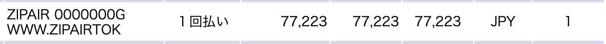

  <h1>AppleとGoogleに遊びに行こう！</h1>
  
村石拓海

# AppleとGoogleに遊びに行こう！

## まえがき

みなさん、旅行はお好きですか？私はどんな旅行でも大好きです。
旅先で有名な観光地を訪れたり、美味しいご当地グルメを食べることはもちろん、気心の知れた者同士で出かければそれだけで幸せなものです。ただ、旅行はお金がかかるものですし、何か物が残るわけではではなく、思い出や経験として残るものです。そのため、人によっては気が乗らない人もいて、賛否が分かれると思います。

ところで、私は今 iOS エンジニアとして株式会社ゆめみで働いています。**iOS エンジニア** という肩書きですが、その実は Apple をはじめとした最先端の技術が好きなただのオタクといったところです。

私自身、最先端の技術への憧れや、エンジニアとして成長するための士気を高めるためにも、アメリカ西海岸シリコンバレーの風を浴びたいと思いますし、モバイルアプリエンジニアであればやはり、 Apple と Google には聖地巡礼したくなるものです。

最先端の技術が好きな人やモバイルアプリエンジニアでさらに頑張っていきたい人、これから目指す人 (学生など) に向けて、**「今すぐにでも！」** 訪れてほしいという思いを込めて、現実的な行き方や (2024年現在) 円安 & 日本以上の物価高でも、あまりお金をかけずにアメリカに行くための tips をお届けできたらと思います！

ちなみに、旅行には宿泊先も重要ですが今回は割愛させていただきます。
金額的には日本のホテルより少し高い程度で見つかると思いますので、ある程度評判を見ながら選ぶといいと思います！

## 交通手段

旅行で何より先に考えなければならないことは**交通手段**です。行きたくても、現実的に行く方法がなければ意味ないですからね。

### 航空会社

ある程度旅慣れた人であれば、日本から海外旅行に安く行こうとするとする場合、お決まりの方法・手段はご存知だと思います。一概には言えませんが以下の条件がよく当てはまるのではないでしょうか？

- 海外の航空会社を利用する
- 関空から出国したり、仁川乗り継ぎで向かう
- 訪問国のハブ空港まで飛んで、乗り継いで地方空港に向かう
- 変な時間のフライトが多い

ことAppleやGoogleのあるシリコンバレーの中心地、サンノゼを訪れることにおいては、上記のあるあるを回避することができます。
それが、今回紹介する **ZIPAIR**[^zipair] です。

[^zipair]: ZIPAIR 会社概要 https://www.zipairtokyo.com/ja/company/

ZIPAIR(正式名: 株式会社ZIPAIR Tokyo)は、コロナ禍の2018年7月に設立された日本企業です。日本航空(JAL)の100%子会社として、北米・アジアに就航しています。
日本の成田空港とシリコンバレーの中心サンノゼ空港を直行便で結んでおり、

| 出発空港 | 到着空港 | 運賃 (燃油込, 空港使用料及び各種諸税別) |
| :--- | :--- | --- |
| 成田 | サンノゼ | ¥50,000~ |
| サンノゼ | 成田 | $337~ (¥50550~) ※$1=¥150換算 |
| 成田 | バンクーバー(カナダ) | ¥33,175~ |
| 成田 | ホノルル(ハワイ) | ¥30,000~ (セールで¥20,000~) |

上記の表の価格で搭乗することができます。セールで上記の金額よりも安く飛ぶことができたり、LCCにありがちな、最安の金額帯でのフライトはごく一部しかないということはなく、時期による価格変動はありますが、年間を通して安い価格帯の日時が多い印象があります。

最初に言い忘れていましたが、日数的には3日もあれば十分ですので、学生であれば長期休みの一部や、社会人であっても、土日休みに有給をつけていただければ往復が可能です。
安い価格帯で往復できる日付を狙えば、12万円あれば往復できると思います。
とはいえ高いので、セール時の安いタイミングを狙うのも手だと思います。
自分は半年前に、空港使用料及び各種諸税込で往復 ¥77,223 で行って帰ってくることができました。

### 現地での移動

**「現地での移動はUberを使いましょう」** と、海外旅行サイトにはよく書いてあります。治安が悪いので、公共交通機関が危険というのは納得できます。ただ、現地の移動、特に今回の場合は街中の短距離での移動で頻繁に Uber を利用すると、1日で日本円にして ¥20,000 くらいはかかると思ったほうがいいでしょう。アメリカの物価を考えると安く感じる気もしますが、一人旅やコストを抑えたい場合は気が引けるのではないでしょうか。もちろん、現地滞在できる時間も限られているので、効率的に動くために利用するのであればいいと思います。

ちなみに、アメリカは車社会ですので、レンタカーも安く借りられますし、ガソリン代も日本より安いです。そのため自分で運転するという手もありますが、日本でいう幹線道路と高速の間みたいな道路を旅行中無事故で運転できる自信がなかったので自分はやめておきました。いつかは海外で運転してみたいですね。

個人的にはあくまでサンノゼに限った話ですが、公共交通機関を利用してもいいのかなと感じています。サンノゼ含む、サンフランシスコベイエリアでは交通系ICカードの Clipper Card があるので作成しておくと便利です。
専用アプリからバーチャルカードを取得して、 Suica 同様 Wallet アプリで利用することもできます。旅のお土産として物理カードも簡単に取得できますが、残念ながら空港では入手できません。ここでは、Clipper Cardの物理カードを入手しながら、AppleとGoogleに向かう道順を紹介します。

1. サンノゼ空港到着口を出て正面の小島のようなエリアにある乗り場からから60系統(北方面)のコミュニティバスが出ているので乗りましょう。終点の Milpitas 駅まで行きます。
2. バス停で降りて正面に BART (メトロ) の Milpitas 駅がありますので、駅構内の左の壁沿いに　Clipper Card を発行できる自動販売機があるのでそちらで発券しましょう。
3. Clipper Card を入手したら BART Milpitas 駅から出て、正面に高架橋が見えると思います。高架橋の上に VTA(ライトレール) の Milpitas 駅がありますので向かい、VTA の 西方面行き (Mountain View行) に乗車しましょう。

  a. Apple に行く場合: 途中の Fair Oaks 駅で降り、56系統 (南方面行) のバスに乗り換えて Wolfe & Homestead バス停で降りると Apple Parkの横に着けます！

  b. Google に行く場合: 終点の Mountain View駅まで行き、40系統 (北方面行) のバスに乗り換えて Charleston & Google バス停で降りると Google本社横に着けます！
  
詳細な生き方は note に記載しています(する予定w)ので、ぜひご覧ください！ (写真や地図も載せる予定です)
## 食事

### 現地での食事

めちゃ高いの一言につきます。個人的な意見ですが、アメリカならではの何かがどうしても食べたいのでなければ、日本から持ち込んだ食料だけで滞在中過ごすのも本気でありと思ってしまいます。
2023年末時点での物価としては、だいたい日本の5~10倍くらいと考えると良いです。
お昼ご飯をレストランで食べたいのであれば、ちょっとした食事でも ¥5000 ~ ¥8000 は覚悟しましょう。参考として、下の表のような価格になっています。食材であれば安価に確保することも可能ではありそうです。

| 商品 | 場所 | 価格($) | 価格(¥) | 備考 |
| :--- | :--- |:--- |:--- |:--- |
| Red Bull| セブンイレブン | $3.80 | ¥570 | 8.4oz 表記 (=250ml) |
| 冷製パスタ | レストラン | $8.69 | ¥1,303 | 麺が伸びていた.. |
| プロテインバー | 空港 | $15.21 | ¥2,282 | 1本満足バーよりちょっと大 |
| 水 (1ℓ) | 空港 | $7.60 | ¥1,140 | ¥1,140/ℓ |
| 水 (1gal) | 地元の商店 | $2.16 | ¥324 | ¥324/oz = ¥86/ℓ |

#### tips

ZIPAIRではアルコール以外の飲食物は機内に持ち込むことができます。前提として国際線は100mL以上の液体は保安検査を通過できないので、保安検査通過後のお店で海外に持って行く食料を調達することをオススメします。成田空港の保安検査場内にはセブンイレブンがあるので、自分はそこで食料を仕入れて海外に行っています。

ただ、アメリカから日本に帰ってくる時はその限りではありません。アメリカの空港で購入する食料より、日本の航空会社の機内で買える食料の方が安いです。1ℓで ¥1,140 する水を買って飛行機に乗った自分ですが、機内で 500mL で ¥250 の水と ¥300 の綾鷹が買えるとして安さに驚くぐらい金銭感覚がおかしくなってました...
