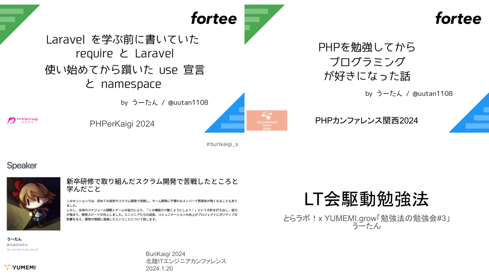
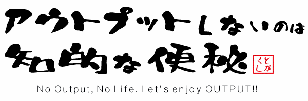

  <h1>読むとLTがしたくてたまらなくなるマニュアル</h1>
  
うーたん (@uutan1108)

# 読むと LT がしたくてたまらなくなるマニュアル

## お前誰よ

株式会社ゆめみの 23 卒のサーバーサイドエンジニアです。X は[@uutan1108](https://twitter.com/uutan1108) でやってます。LT などを定期的にしています。

PHPerKaigi2024, PHP カンファレンス関西 2024, BuriKaigi 2024 で LT や登壇しました。

[speakerdeck.com/ohmori_yusuke](https://speakerdeck.com/ohmori_yusuke)

Speaker Deck にすべての資料があるので、もしよろしければ見てください。

## LT とはなんぞ？

> LT とは Lightning Talks（ライトニングトーク）の略です。"Lightning"は英語で"稲妻"という意味。つまり、直訳すると"稲妻トーク"なのです。...まだ何を言っているかわからない？いいでしょう。"稲妻トーク"の名の通り、LT はいわば「短いプレゼンテーション」のことです。勉強会やイベント、カンファレンスなどで行われる 5 分程度の短いプレゼンテーションなんかは、LT です。LT には、基本的にルールはありません。（ルールがないというルールですね！）ただし制限時間は設けられていて、時間をすぎると強制的に終了、次の発表者に交代！という流れがあります。多くは 3~5 分程度、長くても 10 分程度ではないでしょうか。つまり、時間内だったら何を発表しても OK！どんな風に発表しても OK！どんな小道具を使っても OK！ということです。なんて自由なんだ。

引用元 : <cite>IT 業界でよく聞く「LT」ってなんなの？3 つのメリットを知って、きみも LT してみよう！ https://www.wantedly.com/companies/tobila/post_articles/104468</cite>

## はじめに

### 「アウトプットしないのは知的な便秘」

という言葉があります。LT やブログ、技術同人誌などで「アウトプット」することで、新しいことを学ぶきっかけになったり、学びが深まったりします。

引用元 : <cite>ssmjp とは https://ssm.pkan.org/ssmjp%E3%81%A8%E3%81%AF/</cite>

学んだことをアウトプット（業務で活用、ブログ書く、LT するなど）しなければ、学びを深めることが困難です。アウトプットすることで、未熟な部分や理解が浅いことを把握できます。把握することが次への学びの第一歩になります。

### 直接感想が貰えて、人とのつながりが広がる

オフラインの勉強会やカンファレンスの場合は、発表後に直接フィードバックや感想（「発表よかったです！」、「自分も発表したくなりました！」など）をいただけることがあります。感想をもらえることで、また発表したいと思うようになると思います。発表することで、その勉強会で声をかけられることが増えます。これにより、社外でのつながりや知らない技術について興味をもつきっかけにも繋がります。

### 「30 点で打席に立つ」

[speakerdeck.com/konifar/30dian-deda-xi-nili-tu](https://speakerdeck.com/konifar/30dian-deda-xi-nili-tu)

100 点にするまで我慢してたら、ずっとアウトプットできず「知的な便秘」になってしまいます。何回も打席に立って点数を上げていけばいいと思います。打席に立つことで課題や楽しいことも分かってきます。

### LT は楽しい

LT をして交流することは楽しいです。自己紹介や最近のちょっとした学びを５分間で話してしまいましょう。話すことで情報が整理されます。緊張して「失敗したな…」と思うかもしれませんが、見ている人は大して気にしていないです。あなたが話したいことを話して、視聴者受けはあまり気にせず LT しましょう！意外と刺さる人には刺さっていたりします。

## 少しでも LT に興味を持った方へ

LT したいと思った直後に悩むであろう LT の「テーマ」と「タイトル」の付け方について紹介します。

### テーマの決め方のコツは？

テーマは「複数のところから学んだことや体験したことから決める」のがいいと思います。1 つの情報源から学んだ発表だと理解が浅い場合があります。情報を咀嚼して「あなたの言葉」で伝えるといいと思います。

LT のような短時間で発表する場合、テーマを絞った方がいいこともあります。ソフトウェア設計やソフトウェアのテストのようなテーマだと広すぎるので、「ソフトウェア設計入門でユビキタス言語をつくることについて」のようにテーマを絞ることで視聴者のレベル感やトーク内容を明確化できます。そして、話したいことを話す前に「前提知識、条件について軽く触れる」ことはしましょう。これがないと、視聴者を置いてけぼりにしてしまいます。上記のタイトルの場合は「ユビキタス言語」について解説するスライドも作りましょう。

### タイトルの決め方は？

発表のタイトルの付け方は以下のスライドを参考にすると無難だと思います。

[speakerdeck.com/tomzoh/how-to-hack-the-cfp](https://speakerdeck.com/tomzoh/how-to-hack-the-cfp)

私のタイトルの決め方

- タイトルを見て発表内容が想像しやすいタイトルにしています。
- タイトルを先に決めるのが難しいのであれば、話したいことを箇条書きにしてから、全体像を見てタイトルを決めるのもいいかもしれないです。
- タイトルとスライドの内容が大きく離れていることはよくないので注意しています。

以下のスライドを見て真似するのもいいと思います。

PHPerKaigi2019 スライドまとめ |
[qiita.com/ucan-lab/items/eb66ae31d4859e967fa5](https://qiita.com/ucan-lab/items/eb66ae31d4859e967fa5)

iOSDC 2023 セッション資料まとめ | [qiita.com/yuukiw00w/items/4a8c67a21618fd4626fc](https://qiita.com/yuukiw00w/items/4a8c67a21618fd4626fc)

## よくある質問

スライドを作ろう！と思ったら悩むかもしれない「何のツールで作る？」「発表する前にフィードバックは貰う？」などを紹介をします。

### 何分の発表ならスライドは何枚くらい？

スライドの枚数は話す量や情報量で変わりますが、5 分の LT の場合はスライド 20 枚ぐらいあると丁度いいかもしれないです。(個人の感想)個人差があるので、ブツブツ話しながら１人でリハーサルをすることをおすすめします。時間を計りながらリハーサルをしてスライドの文字数を調整したり、話す内容を調整して発表時間を調整しましょう。

### スライドの作り方(一番の大変かも)

#### Google Slides

私はよく使っています。URL を共有しておけば、自分の PC がなくても発表できます。

#### Microsoft PowerPoint

[www.microsoft.com/ja-jp/microsoft-365/powerpoint](https://www.microsoft.com/ja-jp/microsoft-365/powerpoint)

安定のツール。便利。

#### Canva

[www.canva.com/ja_jp/features/ai-slide/](https://www.canva.com/ja_jp/features/ai-slide/)

AI にスライドを作ってもらうことができます。AI 機能を使わなくても、綺麗なデザインで作ることができます。

revealjs

[revealjs.com](https://revealjs.com/)

エンジニアらしく、マークダウンでスライドを作成できます。使っている方をたまに見かけます。

### 本番の前に何人かに見せる？フィードバックもらう？

不安であれば見てもらいましょう。見てほしい理由を明確にしておきましょう。

- 技術について正しいのかを確認してほしい場合

  - 技術に詳しそうな方に見てもらいましょう

- スライドのデザインなどに不安がある場合

  - 見やすいスライドをつくる方に相談しましょう

- 話し方に不安がある方
  - 実際に発表を見てもらってからフィードバックをもらいましょう

そこまで不安がない方はフィードバックをもらう必要はないと思います。

### 何日前には完成させておく？

フィードバックはいらないという方は前日に作るでも問題ないと思います。フィードバックが欲しい方は１週間前ぐらいに完成させておくとフィードバックを依頼しやすくなると思います。

## 必ず注意すること

### 行動規範を読もう、守ろう

「行動規範」(code of conduct)に違反するような発表を行うことは許されません。参加者の行動規範に違反するような言動も許されません。「ハラスメント」「性的な発言」「容姿に関する発言」など参加者を不快にさせる言動はしないようにしましょう。スライド内でも扱ってはいけません。以下の行動規範は YUMEMI.grow の行動規範です。LT をしに参加した勉強会や LT 会でも明記されていると思います。勉強会に参加する際は必ず守りましょう。

> YUMEMI.grow はすべての参加者が歓迎され、安全で成長できる場であることを目指しています。その実現のため、他の参加者が不快に感じる行為を禁止します。すべての参加者にとって成長機会となるよう、敬意と優しさをもって行動してください。 もし、ハラスメント行為、差別行為、勧誘行為など、疑わしい行動または破壊的な行動について気になることがございましたら、イベント主催までお知らせください。主催の判断により、該当者の退室、参加の拒否など対応を求め実行します。

引用元 : <cite>YUMEMI.grow 行動規範 https://yumemi.connpass.com/event/310541/</cite>

## 終わりに

社外の LT 会でも、マサカリが飛んでくることはあまりありません。(個人的な感想)発表は他者に伝えるためでもありますが、「自身が学ぶため」でもあります。発表やアウトプット、言語化することで未知ことを把握することができたり、理解が浅いということを知ることができます。定期的に言語化することは「あなた自身の学び」になります。

[connpass.com](https://connpass.com/)

connpass というサイトで「LT」と検索し、参加してみましょう！最初は視聴者でも参加すると楽しいと思います！参加しているうちに「LT したい…」と思うはずです。

## SHIROBAKO の杉江さんの言葉

> 「僕は才能って言うのは、何よりまずチャンスをつかむ握力と失敗から学べる冷静さだと思う。絵の上手い下手は、その次だ」

> 「僕は僕より上手い人間が、わずかな自意識過剰やつまらない遠慮のせいで、チャンスを取りこぼして来たのを何度も見た。惜しいと思うよ、今だにね」

引用元 : <cite>TV アニメ「SHIROBAKO」22 話</cite>

武蔵野アニメーション所属の最古参のアニメーターの言葉です。いい言葉ですね。

SHIROBAKO はいい話なので観てください。私は「今井みどり」が好きっす！
