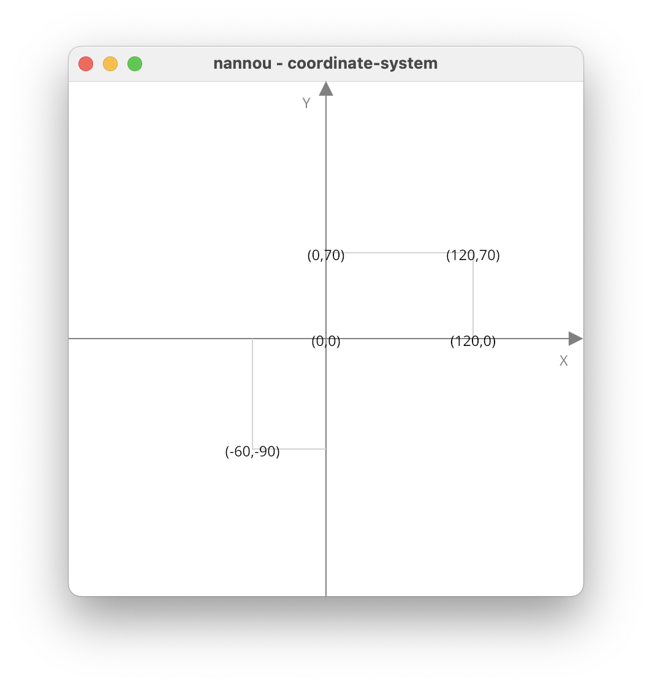
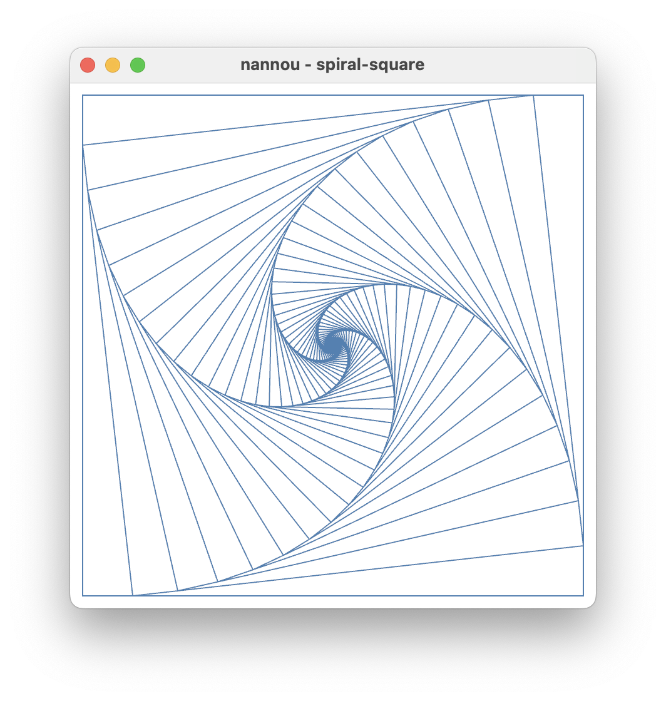
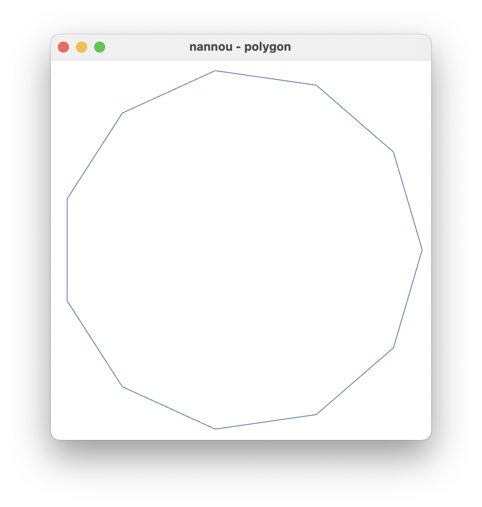
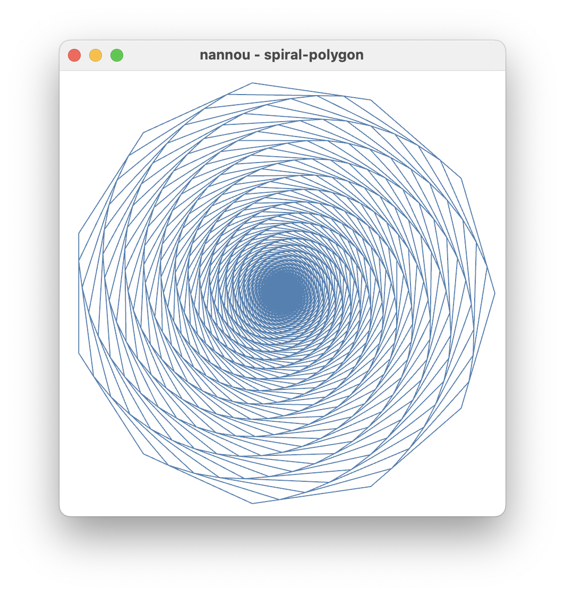

<div class="doc-header">
  <h1>Rust Nannou 作図事例</h1>
  <div class="doc-author">宇佐見公輔</div>
</div>

# Rust Nannou 作図事例

## Nannou とは

何らかの表現を創造することを目的としたプログラミングを、クリエイティブコーディングと呼びます。ソフトウェア開発で行うプログラミングは一般的に何らかの機能を実現することを目的としますが、それとは目的が異なっています。

Nannou は、Rust 言語でクリエイティブコーディングをするためのツールキットです。Nannou の基本的な使いかたについては、前回のゆめみ大技林に掲載した記事「Rust Nannou でクリエイティブコーディング」に書いていますので、そちらをご覧ください。

今回は、実際に Nannou を使って作図する事例を紹介します。

## Nannou の座標系

Nannou の座標系は、中心を原点として x 軸の正の方向は右方向、y 軸の正の方向は上方向です。これを理解するために、座標軸を描画してみます。

```rust
use nannou::prelude::*;

fn main() {
    nannou::app(model).run();
}

struct Model {}

fn model(app: &App) -> Model {
    app.new_window().size(420, 420).view(view).build().unwrap();
    Model {}
}

fn view(app: &App, _model: &Model, frame: Frame) {
    let draw = app.draw();
    draw.background().color(WHITE);
    let win = app.window_rect();
    draw.arrow()
        .points(win.mid_left(), win.mid_right())
        .head_length(12.0)
        .head_width(6.0)
        .color(GRAY);
    draw.text("X").xy(win.mid_right() + pt2(-16.0, -16.0)).color(GRAY);
    draw.arrow()
        .points(win.mid_bottom(), win.mid_top())
        .head_length(12.0)
        .head_width(6.0)
        .color(GRAY);
    draw.text("Y").xy(win.mid_top() + pt2(-16.0, -16.0)).color(GRAY);
    draw.text("(0,0)").xy(pt2(0.0, 0.0)).color(BLACK);
    draw.polyline()
        .points([pt2(120.0, 0.0), pt2(120.0, 70.0), pt2(0.0, 70.0)])
        .color(LIGHTGRAY);
    draw.text("(120,0)").xy(pt2(120.0, 0.0)).color(BLACK);
    draw.text("(120,70)").xy(pt2(120.0, 70.0)).color(BLACK);
    draw.text("(0,70)").xy(pt2(0.0, 70.0)).color(BLACK);
    draw.polyline()
        .points([pt2(-60.0, 0.0), pt2(-60.0, -90.0), pt2(0.0, -90.0)])
        .color(LIGHTGRAY);
    draw.text("(-60,-90)").xy(pt2(-60.0, -90.0)).color(BLACK);
    draw.to_frame(app, &frame).unwrap();
}
```

`draw.arrow()` で座標軸を描画して、`draw.text()` で座標軸のラベルを描画しています。また、`(0,0)`、`(120,70)`、`(-60,-90)` の点を例示しています。

今回のコードでは `nannou:app` 関数を使う方法を採用しています。

```rust
fn main() {
    nannou::app(model).run();
```

この方法ではウィンドウを自分で生成します。このとき、ウィンドウのサイズを `size` 関数で指定できます。今回はウィンドウのサイズを 420×420 の正方形にします。

```rust
fn model(app: &App) -> Model {
    app.new_window().size(420, 420).view(view).build().unwrap();
```

先ほどのコードで描画した結果は次のようになります。



## 再帰的な正方形に現れる螺旋

正方形をある一定のルールで再帰的に描画したとき、螺旋（らせん）曲線が現れるという事例を紹介します。まず、コード全体を示します。

```rust
use nannou::prelude::*;

fn main() {
    nannou::app(model).update(update).run();
}

struct Model {
    updated_time: f32,
    vertex1: Point2,
    vertex2: Point2,
    vertex3: Point2,
    vertex4: Point2,
}

fn model(app: &App) -> Model {
    app.new_window().size(420, 420).view(view).build().unwrap();
    Model {
        updated_time: 0.0,
        // 最初の正方形の頂点座標
        vertex1: pt2(200.0, 200.0),
        vertex2: pt2(-200.0, 200.0),
        vertex3: pt2(-200.0, -200.0),
        vertex4: pt2(200.0, -200.0),
    }
}

fn update(app: &App, model: &mut Model, _update: Update) {
    if app.time < model.updated_time + 0.5 {
        return;
    }
    model.updated_time = app.time;

    // それぞれの頂点を、隣の頂点に向かって少し移動する
    let vertex1 = model.vertex1;
    let vertex2 = model.vertex2;
    let vertex3 = model.vertex3;
    let vertex4 = model.vertex4;
    model.vertex1 = vertex1 + (vertex2 - vertex1) * 0.1;
    model.vertex2 = vertex2 + (vertex3 - vertex2) * 0.1;
    model.vertex3 = vertex3 + (vertex4 - vertex3) * 0.1;
    model.vertex4 = vertex4 + (vertex1 - vertex4) * 0.1;
}

fn view(app: &App, model: &Model, frame: Frame) {
    let draw = app.draw();
    if app.elapsed_frames() == 0 {
        draw.background().color(WHITE);
    }
    draw.polyline()
        .points_closed(vec![
            model.vertex1,
            model.vertex2,
            model.vertex3,
            model.vertex4,
        ])
        .color(STEELBLUE);
    draw.to_frame(app, &frame).unwrap();
}
```

`update` 関数の中では、前の正方形に対して少し小さな正方形を作成しています。具体的には、前の正方形のそれぞれの頂点を、隣の頂点に向かって少し（辺の長さの 0.1 倍）だけ移動させて新しい頂点にしています（別の言い方では、1 対 9 に内分する点）。

このときの座標の計算には、ベクトルの考え方を使っています。点 P から点 Q に向かって距離の 0.1 倍だけ移動するとします。P の位置ベクトルを OP、P から Q へのベクトルを PQ とすると、移動先の点の位置ベクトルは `OP + PQ * 0.1` となります。ここで、PQ は P の位置ベクトル OP と Q の位置ベクトル OQ を使って `PQ = OQ - OP` と書けます。これを使うと、移動先の位置ベクトルは `OP + (OQ - OP) * 0.1` となります。これをコードにすると次のようになります。

```rust
    model.vertex1 = vertex1 + (vertex2 - vertex1) * 0.1;
```

新しい正方形は前の正方形の内接正方形になります。その新しい正方形に対して、再び同じ操作で少し小さな内接正方形を作成します。この操作を繰り返して、少しずつ小さな正方形を再帰的に作成していきます。

`update` 関数の最初の部分に時間経過の判定を入れることで、およそ 0.5 秒ごとに正方形をひとつずつ作成しています。これにより、正方形が再帰的に作成される様子が見やすくなります。

```rust
fn update(app: &App, model: &mut Model, _update: Update) {
    if app.time < model.updated_time + 0.5 {
        return;
    }
    model.updated_time = app.time;
```

こうして作成された正方形の頂点の軌跡として、螺旋曲線が現れます。この記事では詳しくは述べませんが、実は、対数螺旋と呼ばれる曲線と一致します。

どのような螺旋になっているかは、実際の描画結果を見るとわかりやすいです。先ほどのコードで描画した結果は次のようになります。数学的な操作で作った画像ですが、ビジュアル的に面白い画像になっているのではないでしょうか。



## 正多角形の描画

先ほどの事例の正方形を、もっと頂点が多い正多角形に置き換えることを考えます。そのための準備として、まずは正多角形を描画する方法を紹介します。

```rust
use nannou::prelude::*;

fn main() {
    nannou::app(model).run();
}

struct Model {
    vertices: Vec<Point2>,
}

fn model(app: &App) -> Model {
    app.new_window().size(420, 420).view(view).build().unwrap();
    // 正多角形の頂点数
    let num = 11;
    // 正多角形の頂点座標
    let vertices = (0..num)
        .map(|i| {
            // i番目の頂点の偏角
            let angle = (i as f32) * 2.0 * PI / (num as f32);
            // x座標とy座標を計算する
            let x = angle.cos() * 200.0;
            let y = angle.sin() * 200.0;
            pt2(x, y)
        })
        .collect();
    Model { vertices }
}

fn view(app: &App, model: &Model, frame: Frame) {
    let draw = app.draw();
    draw.background().color(WHITE);
    draw.polyline()
        .points_closed(model.vertices.iter().cloned())
        .color(STEELBLUE);
    draw.to_frame(app, &frame).unwrap();
}
```

考え方としては、原点を中心とした円の上に、等間隔に頂点を配置することで正多角形を描画します。0 番目の頂点は x 軸上の正の側に配置し、そこから反時計回りに頂点を配置します。一周の角度が 2π ラジアンですから、正 num 角形の頂点であれば角度 2π / num ラジアンごとに頂点を配置すればよいです。つまり、i 番目の頂点の偏角は `i * 2 * PI / num` ラジアンとなります。

偏角から x 座標と y 座標を計算します。このためには、三角関数 `cos()` と `sin()` を使えばよいです（極座標から直交座標への変換）。これをコードにすると次のようになります。

```rust
            // i番目の頂点の偏角
            let angle = (i as f32) * 2.0 * PI / (num as f32);
            // x座標とy座標を計算する
            let x = angle.cos();
            let y = angle.sin();
```

先ほどのコードで正多角形を描画した結果は次のようになります。



## 再帰的な多角形に現れる螺旋

では、正方形を正多角形に変えた事例をみます。まず、コード全体を示します。

```rust
use nannou::prelude::*;

fn main() {
    nannou::app(model).update(update).run();
}

struct Model {
    updated_time: f32,
    vertices: Vec<Point2>,
}

fn model(app: &App) -> Model {
    app.new_window().size(420, 420).view(view).build().unwrap();
    let num = 11;
    let vertices = (0..num)
        .map(|i| {
            let angle = (i as f32) * 2.0 * PI / (num as f32);
            let x = angle.cos() * 200.0;
            let y = angle.sin() * 200.0;
            pt2(x, y)
        })
        .collect();
    Model { updated_time: 0.0, vertices }
}

fn update(app: &App, model: &mut Model, _update: Update) {
    if app.time < model.updated_time + 0.5 {
        return;
    }
    model.updated_time = app.time;

    // それぞれの頂点を、隣の頂点に向かって少し移動する
    let vertices = &model.vertices;
    let num = vertices.len();
    model.vertices = (0..num)
        .map(|i| {
            let next = (i + 1) % num;
            vertices[i] + (vertices[next] - vertices[i]) * 0.23
        })
        .collect();
}

fn view(app: &App, model: &Model, frame: Frame) {
    let draw = app.draw();
    if app.elapsed_frames() == 0 {
        draw.background().color(WHITE);
    }
    draw.polyline()
        .points_closed(model.vertices.iter().cloned())
        .color(STEELBLUE);
    draw.to_frame(app, &frame).unwrap();
}
```

考え方はすでに出てきた事例の組み合わせです。`model` 関数で正多角形を作成しています。

`update` 関数の中では、前の正多角形の頂点を隣の頂点に向かって少し（辺の長さの 0.23 倍）だけ移動させて新しい頂点にしています。これによって、前の正多角形に内接する正多角形を作成しています。このコードでは `map` を使って次のように実装しています。

```rust
    model.vertices = (0..num)
        .map(|i| {
            let next = (i + 1) % num;
            vertices[i] + (vertices[next] - vertices[i]) * 0.23
        })
        .collect();
```

この操作を繰り返して、正多角形を再帰的に作成していきます。およそ 0.5 秒ごとに正多角形をひとつずつ作成しているため、再帰的に作成される様子が見やすくなっています。

先ほどのコードで描画した結果は次のようになります。正多角形の頂点の軌跡として、螺旋曲線が現れます。これもビジュアル的に面白い画像になっているのではないでしょうか。



頂点の数や頂点の移動量を変えると螺旋も変わります。ぜひ、試してみてください。

## 参考文献

* 巴山竜来、数学から創るジェネラティブアート - Processing で学ぶかたちのデザイン、技術評論社、2019

## サンプルコード

本記事で紹介したサンプルコードは GitHub リポジトリで公開しています。

## Qiita 記事の案内

本記事は Qiita でも読むことができます。
